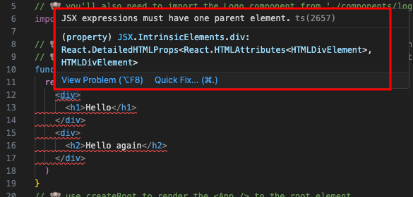
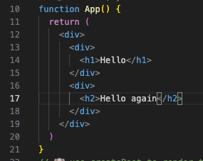
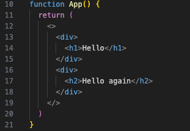
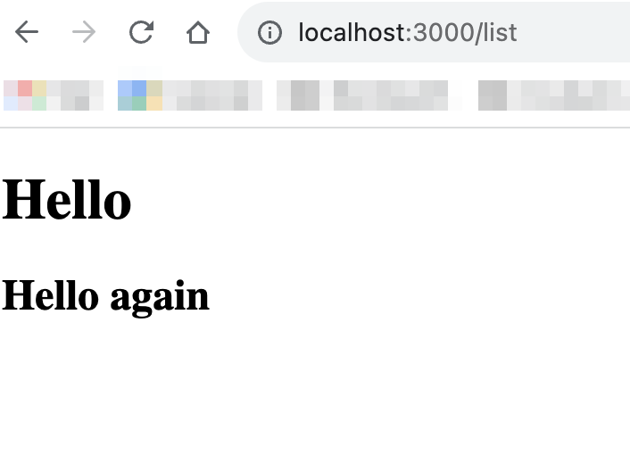

# Render a React App

## 📝 Your Notes

- `The React component should only have one parent element`:
    <details>
    <summary><b>Example, when trying to create a React component with two &lt;div&gt;/ 'parent' elements:</b></summary>

  ```js
  function App() {
    return (
      <div>
        <h1>Hello</h1>
      </div>
      <div>
        <h2>Hello again</h2>
      </div>
    )
  }
  ```

  **The error in the editor:**

  

  **The error in the browser:**

  

    </details>
  <br>
    <details>
    <summary><b>Example, when creating a React component the correct way:</b></summary>

  1. Either use another &lt;`div`&gt; (or any other semantically appropriate
     element) as a parent one:

     

  2. Or use a JSX fragment `<>...</>` to wrap the two &lt;`div`&gt;'s:

     

  **No errors in the browser:**

  
  </details>

  ✅ Note that when using the JSX fragment it will not add any additional
  element to the HTML document, while using any other element as a parent one -
  they will be rendered.

## Background

The first step to any React app is to create a component and render it to the
page. In modern applications with modern tools, this means you'll import React
and ReactDOM and use them to create React elements, and render those to a `div`.

## Exercise

Production deploys:

- [Exercise](https://exercises-01-bootstrap.bookshelf.lol/exercise)
- [Final](https://exercises-01-bootstrap.bookshelf.lol/)

👨‍💼 I'm excited to get started with you! Let's start out by rendering our awesome
logo and the title of our app. We'll eventually want to allow people to login so
let's also render Login and Register buttons.

### Files

- `src/index.js`

## Extra Credit

### 1. 💯 Use `@reach/dialog`

[Production deploy](https://exercises-01-bootstrap.bookshelf.lol/extra-1)

👨‍💼 When the user clicks "Login" or "Register", we should open a modal with a
form for them to provide their username and password.

In this extra credit, get the `Dialog` component from `@reach/dialog` and make
it open when the user clicks the Login or Register button. It's a fantastic
component with a great API and fantastic accessibility characteristics.

📜 https://reacttraining.com/reach-ui/dialog

💰 as with everything, there are many ways to do this. For me, I actually render
two individual dialogs and toggle which is open based on a `openModal` state
which can be set to `none`, `login`, or `register`.

💰 Don't forget to include the styles: `import '@reach/dialog/styles.css'`

**Files:**

- `src/index.js`

### 2. 💯 Create a LoginForm component

[Production deploy](https://exercises-01-bootstrap.bookshelf.lol/extra-2)

👨‍💼 The user should be able to login or register by providing a username and
password.

For this one, create a `LoginForm` component which renders a form accepting a
username and password. When the user submits the form, it should call an
`onSubmit` prop with the `username` and `password`. Here's how it will be used:

```javascript
function Example() {
  function handleSubmit(formData) {
    console.log('login', formData)
  }
  return <LoginForm onSubmit={handleSubmit} buttonText="Login" />
}
```

That should render a form where the submit button says "Login" and when the user
clicks it, you'll get a console.log with the form's data.

**Files:**

- `src/index.js`

## 🦉 Elaboration and Feedback

After the instruction, if you want to remember what you've just learned, then
fill out the elaboration and feedback form:

https://ws.kcd.im/?ws=Build%20React%20Apps&e=01%3A%20Render%20a%20React%20App&em=
